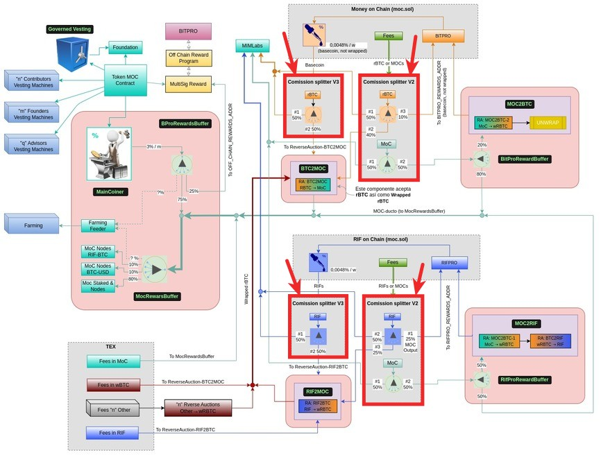

# Upgrade version v0.1.15 - Deploy commission splitter & Changer commissions fees

This upgrade responds to the proposal for a fee increase in the *Money on Chain* and *RIF on Chain* Protocols whose rationale can be seen in the [*Money on Chain Forum*](https://forum.moneyonchain.com) in [this article](http://bit.ly/3ZB4HlP).


## Technical brief of the proposed solution

We are submitting this technical proposal for a fee increase in the Money on Chain and RIF on Chain protocols. Our proposal aims to improve the sustainability and development of these protocols, while ensuring their long-term viability and effectiveness.


### **Fundamentals**

As per the [document provided by Max Carjuzaa](http://bit.ly/3ZB4HlP), Co-Founder of Money on Chain, the proposed fee increase will be essential to support the growth and sustainability of these protocols. With the increasing demand for decentralized finance (DeFi) applications and the growth of the crypto market, it is important to ensure that these protocols can keep up with the market demands.


### **Implementation**

To implement the fee increase, we propose the following steps:

1. We will deploy new commission splitters with appropriate percentages and outputs pointing to Reverse Auction and the splitter where the current commission splitters point.
2. We will prepare a changer that will change the commission percentages and (X)Pro, as well as change the addresses of interest and fee outputs to point to the new commission splitters deployed in step 1.
3. The fee for minting or redeeming tokens paid with RBTC or RIF will increase from 0.1 to 0.2.
4. The fee for minting or redeeming tokens paid with MoC tokens will increase from 0.05 to 0.15.
5. The yearly fee paid by BPRO and RIFP holders will be increased to 1%.
6. We will deploy the changer from step 2, which will be subject to a vote.




The modifications will be applied to the components outlined in red. The MOC splitters will be modified and new instances of commission splitters will be created. These changes are straightforward and simple, making them the most convenient modification alternative for the protocol.

These steps will ensure that the fee increase is implemented in a transparent and efficient manner, while minimizing any disruption to the protocols' functionality. Furthermore, the proposed fee increase will be in line with market standards and ensure the long-term sustainability of the protocols.


## Deploy new commission splitters


Standing in the `scripts/deploy/upgrade_v0.1.15` path of the [MOC repository](https://github.com/money-on-chain/main-RBTC-contract), we run these commands:

```js
$ truffle exec 1_deploy_CommissionSplitterV2.js --network rskMocMainnet2
```

```js
$ truffle exec 4_deploy_CommissionSplitterV3.js --network rskMocMainnet2
```

Then standing in the `scripts/deploy/upgrade_v0.1.15` path of the [ROC repository](https://github.com/money-on-chain/RDOC-Contract), we run these commands:


```js
$ truffle exec 1_deploy_CommissionSplitterV2.js --network rdocMainnet
```

```js
$ truffle exec 4_deploy_CommissionSplitterV3.js --network rdocMainnet
```


## Deploy Changer (Combined MOC & ROC)


Standing in the `scripts/deploy/upgrade_v0.1.15` path of the [MOC repository](https://github.com/money-on-chain/main-RBTC-contract), we run these commands:

**FIX THIS!**

```js
truffle exec 10_deploy_FeeIncreaseProposalCombined.js --network rskMocMainnet2
```


## Deploy Addresses

**FIX THIS!**

✓ [This is the pull request](https://github.com/money-on-chain/fix_me) to add these changes to the repository.

✓ The `change contract`  to make the changes that is also already deployed in `mainnet` would be this [`0x???`](https://explorer.rsk.co/address/0x???__ctab=Code)

✓ This is the `change contract` that will be submitted to a vote.

✓ The upgrade delegator in `mainet` is [`0x5cE577f6Ec969CE9a282838D350206C52A6F338C`](https://explorer.rsk.co/address/0x5cE577f6Ec969CE9a282838D350206C52A6F338C?__ctab=Code)


**Proxies**

|  Contract  |  Address |  
|:---|:---|
|  `CommissionSplitterV2`  | [0x???](https://explorer.rsk.co/address/0x???) |
|  `CommissionSplitterV3`  | [0x???](https://explorer.rsk.co/address/0x???) |


**Implementations**

|  Contract  |  Address |  
|:---|:---|
|  `CommissionSplitterV2`  | [0x???](https://explorer.rsk.co/address/0x???) |
|  `CommissionSplitterV3`  | [0x???](https://explorer.rsk.co/address/0x???) |
